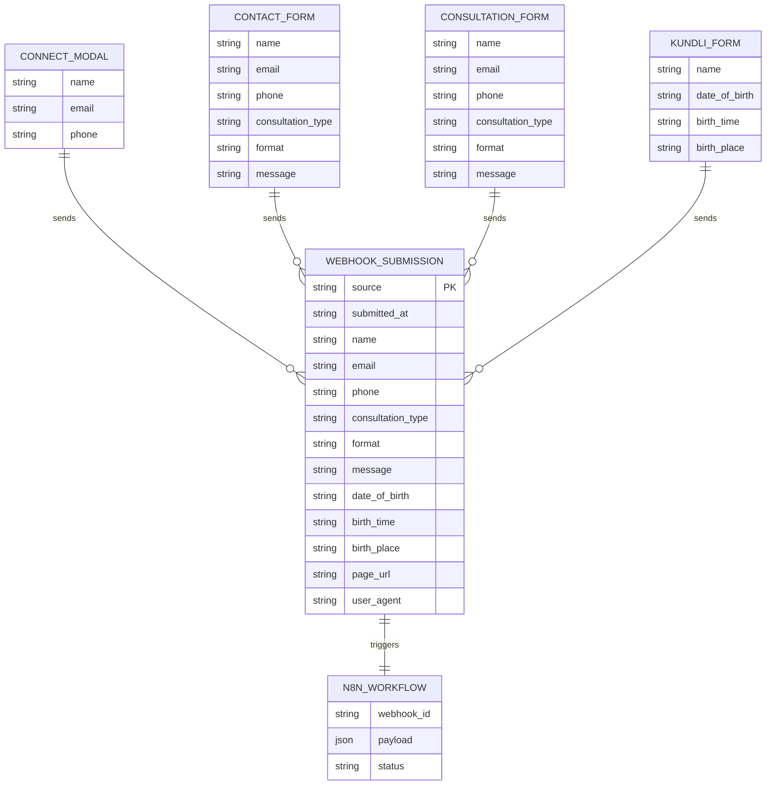

# Form Data → n8n Webhook ERD

All user form submissions on the Gurudev Anand site are sent as a single JSON payload to the n8n webhook. The `source` field identifies which form was used.

## Webhook endpoint

```
POST https://n8n.srv981435.hstgr.cloud/webhook/7a8cc40f-1c4a-4de0-8f76-019b04b2d3d1
Content-Type: application/json
```

## Entity relationship diagram



## Payload by form source

| Field | connect_modal | contact_form | consultation_form | kundli_calculator |
|-------|:-------------:|:------------:|:-----------------:|:-----------------:|
| `source` | ✓ | ✓ | ✓ | ✓ |
| `submitted_at` | ✓ | ✓ | ✓ | ✓ |
| `name` | ✓ | ✓ | ✓ | ✓ |
| `email` | ✓ | ✓ | ✓ | — |
| `phone` | ✓ | ✓ | ✓ | — |
| `consultation_type` | — | ✓ | ✓ | — |
| `format` | — | ✓ | ✓ | — |
| `message` | — | ✓ | ✓ | — |
| `date_of_birth` | — | — | — | ✓ |
| `birth_time` | — | — | — | ✓ |
| `birth_place` | — | — | — | ✓ |
| `page_url` | ✓ | ✓ | ✓ | ✓ |
| `user_agent` | ✓ | ✓ | ✓ | ✓ |

## Example payloads

**Connect modal (Let's Connect To Know More)**

```json
{
  "source": "connect_modal",
  "submitted_at": "2026-05-19T10:30:00.000Z",
  "name": "Priya Sharma",
  "email": "priya@example.com",
  "phone": "+91 98765 43210",
  "page_url": "https://gurudev-anand.com/#sciences",
  "user_agent": "Mozilla/5.0 ..."
}
```

**Consultation / contact form**

```json
{
  "source": "consultation_form",
  "submitted_at": "2026-05-19T10:30:00.000Z",
  "name": "Rahul Kapoor",
  "email": "rahul@example.com",
  "phone": "+91 98763 44400",
  "consultation_type": "normal",
  "format": "video",
  "message": "DOB: 15 Aug 1990, 6:30 AM, Chandigarh. Career guidance.",
  "page_url": "https://gurudev-anand.com/consultation",
  "user_agent": "Mozilla/5.0 ..."
}
```

**Kundli calculator**

```json
{
  "source": "kundli_calculator",
  "submitted_at": "2026-05-19T10:30:00.000Z",
  "name": "Ananya Verma",
  "date_of_birth": "1992-03-22",
  "birth_time": "14:15",
  "birth_place": "Delhi, India",
  "page_url": "https://gurudev-anand.com/#kundali",
  "user_agent": "Mozilla/5.0 ..."
}
```

## Success flow

1. User submits a form → `submitToN8nWebhook()` POSTs JSON to n8n.
2. n8n workflow runs (email, CRM, Google Sheet, etc.).
3. Webhook returns HTTP 2xx → UI shows the success message.
4. If the request fails → UI shows an error; success is **not** shown.

## Local development (CORS)

If the browser blocks direct calls to n8n, set in `.env.local`:

```
VITE_N8N_WEBHOOK_URL=/api/n8n-webhook
```

Vite proxies `/api/n8n-webhook` to the n8n URL during `npm run dev`.
